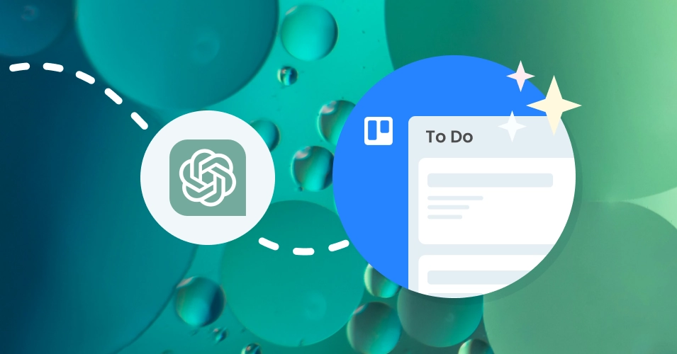
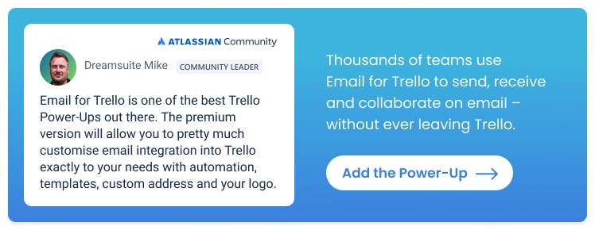

# 用ChatGPT Team提升团队效率：邮件处理不再是负担

---

团队邮件堆积如山？客户咨询回复总是慢半拍？OpenAI推出的ChatGPT Team正在改变团队协作的游戏规则。这不是又一个"听起来很美"的AI工具——它能实实在在地帮你的团队每天省下几小时，让重复性邮件工作不再占用宝贵的脑力资源。接下来我们聊聊，这个工具到底能为你的团队做什么。

---

## ChatGPT Team到底给了你什么

OpenAI的这个团队版本，配置其实挺实在的：

**GPT-4模型** – 这是OpenAI目前最强的AI大脑，处理复杂问题的准确度比之前的版本高出不少。遇到那种需要前后文理解、需要一点创意的任务时，它不会给你瞎编。

**32K上下文窗口** – 说人话就是，它一次能"记住"大约2.5万个单词的内容。如果你要处理长篇邮件、整理会议记录或者分析客户反馈，这个容量够用了。GPT-3那会儿只有4000个token，处理长文本时经常"失忆"。

**团队工作空间** – 你可以创建自定义的GPT助手（就是针对你们公司具体需求调教过的版本），然后分享给整个团队用。还有管理后台，方便老板或HR统一管理。

**额外工具包** – 包括DALL·E图像生成、高级数据分析、网页浏览等功能，而且能提前体验新功能。这些在免费版里是没有的。

## 怎么用它来提升团队效率

ChatGPT的真正价值在于，你可以根据自己的工作场景去调教它。写代码可以，做创意也行，但我们这里主要聊聊怎么用它处理邮件——毕竟大多数团队每天都被邮件淹没。

对于邮件量大的团队来说，ChatGPT能快速生成邮件模板，帮你写那些需要斟酌措辞的敏感邮件，甚至批量产出营销文案。重复性的活儿交给它，你的注意力就能放在更重要的决策上。

### 速度翻倍，错误更少

ChatGPT Team用的是GPT-4，这意味着处理能力更强，输出质量更稳定。你给它什么输入，它都能给出靠谱的结果。

如果你的团队每天要回复大量类似的客户咨询，最实用的办法是先建一个邮件模板库。让ChatGPT帮你写好各种场景的标准回复，团队成员直接调用就行。想让团队协作更高效？👉 [解锁ChatGPT Team完整功能，让AI真正为团队省时间](https://shaoyumi.com/buy/65)，从邮件模板开始改造工作流程，错误率能降一大截。

### 团队协作不再各干各的

ChatGPT Team提供的团队工作空间，最大的好处是可以共享自定义GPT和对话记录。这意味着什么？如果你花时间调试出了一个好用的提示词或指令模板，可以直接分享给全团队——大家不用重复造轮子，AI输出的质量也能保持一致。

比如说，你们公司的客服团队可以共享一个专门处理退款申请的GPT助手，销售团队可以共享一个写提案邮件的助手。每个人打开就能用，不需要重新训练。

这种标准化的好处是，新人上手快，老员工效率高，整个团队的输出质量也有保障。

### 额外工具不是摆设

ChatGPT Team附带的那些高级功能，并不是为了凑数。高级数据分析可以帮你写代码、测试逻辑；视觉功能能识别图片内容；浏览功能可以实时抓取网上的信息。

这些功能在免费版里是没有的。如果你的团队需要处理数据、分析图表或者快速查找行业资讯，这些工具能省不少事。

举个例子，市场部门可以用DALL·E快速生成营销图片原型，运营团队可以用数据分析功能整理用户反馈，客服可以用浏览功能查最新的产品信息——这些都能在一个平台完成。

---

## 为什么邮件处理适合用ChatGPT Team

总结一下：如果你的团队每天要处理大量邮件、需要快速响应客户、还要保证回复质量不出错，ChatGPT Team就是为这种场景设计的。它不仅能提升个人效率，更重要的是让整个团队的协作变得更流畅。模板共享、质量稳定、处理速度快——这三点就足够让它成为团队的得力助手。想让团队真正用上AI的力量？👉 [马上体验ChatGPT Team完整版](https://shaoyumi.com/buy/65)，从邮件效率开始改变工作方式。
